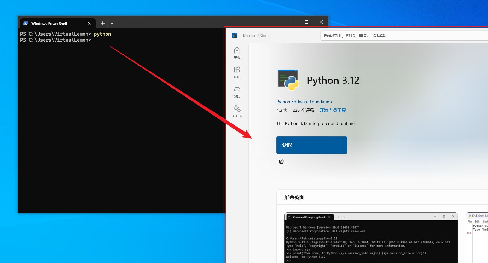
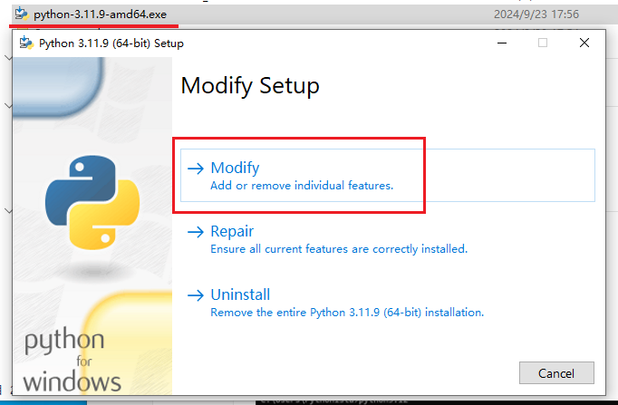
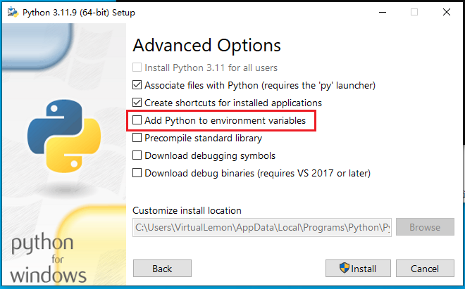
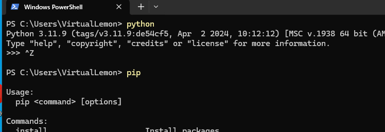

# Troubleshooting

尝试总结了一些配置环境时会遇到的问题

~~为了弄到这些截图，辛苦我的电脑跑虚拟机了~~

## 微软商店？？

当你安装完成之后满心欢喜地在终端输入了`python`按下回车，跳出的却是 Microsoft Store 的 Python 下载页面w

> 如果报出了未找到指令的错误，同理。

一眼盯帧，鉴定为：**没有将Python本体添加到环境变量PATH中**，最可能的原因是启动安装程序之后直接点了Install Now，什么额外选项都没有设置。

这时可以在终端改为输入`py`来尝试调用Python启动器，一般默认安装会安装它。

成功进入了Python Shell，说明安装是成功的。如何添加环境变量参见下文。

## 找不到pip

一眼盯帧，鉴定为：**没有将Python本体添加到环境变量PATH中**

这是因为pip的可执行文件位于 python/Scripts 目录下，如果Python本体没有添加到PATH的话pip显然也就没有了。

要想修复这种情况，除了手动添加外，还可以使用安装包进行修改：

找到先前下载的安装程序，运行。

安装器检测到已经安装过了Python，会询问你要对已安装的Python做什么。这里选择 Modify 做修改。

一路 Next 直到看到添加到环境变量的选项。勾选它，应用更改。等待完成。

重启在安装前就已经打开的终端，再次尝试调用pip

这下不光pip能用了，python也能直接用了，好耶！

> —— 那我要是不想添加环境变量，但又想用pip呢？
>
> pip本质上是Python的一个可选的内置库，因此可以通过解释器参数 `-m` 启动
>
> 

## 找不到py

~~你才找不到py！~~

一眼盯帧，鉴定为：**没有安装Python启动器**，最可能的原因是点了自定义安装后自己把安装启动器的选项取消勾选了。

你当然可以在不使用启动器的情况下使用Python本体，但此时请确保本体已经添加到了环境变量，否则你将无法从终端直接使用Python。

此时建议重新启动安装程序，像前文添加环境变量那样让它帮你安装启动器。

---

如果遇到了别的乱七八糟的情况，且将Python扬了按照教程重装也解决不了的话，欢迎来群里提问w
